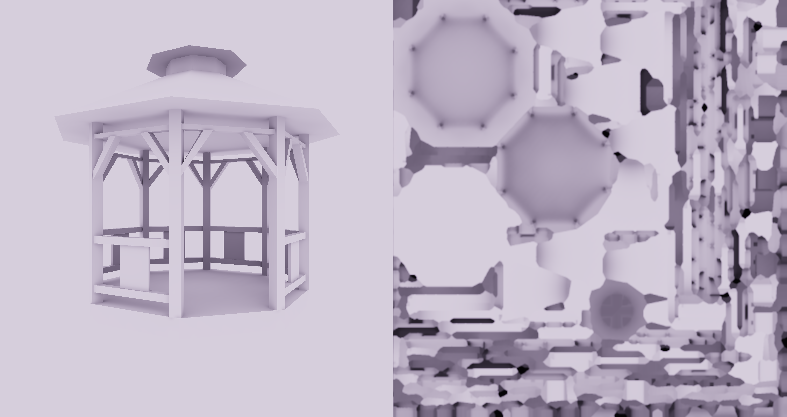

# lightmapper_odin

**lightmapper_odin** is a lightmap baking library for the Odin programming language and the SDL_GPU Graphics API, heavily inspired by [lightmapper.h](https://github.com/ands/lightmapper).
With this library, your existing real-time SDL_GPU renderer can be easily used to build high quality lightmaps.

**lightmapper_odin** can be used to bake Ambient Occlusion, as well as Global Illumination depending on the number of iterations used.
Any kind of light or emissive surface is supported as long as they are simply drawn using their emissive colors.
Lightmap UVs have specific requirements, e.g. no uv-overlap; for this reason it may be a good idea to have them be automatically
generated, and let your artist work on more enjoyable things. You could either write your own tool for this or you could use one of the following:
- [thekla_atlas](https://github.com/Thekla/thekla_atlas)
- [xatlas](https://github.com/jpcy/xatlas)
- [uvatlas](https://github.com/microsoft/UVAtlas)

Depending on the requirements of your application, you may need to compress these lightmaps as well. As you probably know, GPUs have special hardware for sampling compressed textures at runtime.
One of the well-supported formats is BC6H, which was specifically designed for HDR textures (and lightmaps are usually HDR).
To compress to BC6H you can use one of the following tools:
- [GPURealTimeBC6H](https://github.com/knarkowicz/GPURealTimeBC6H.git)
- [DirectXTex](https://github.com/microsoft/DirectXTex.git)

This library uses the hemicube approach, which is a somewhat old-school method for baking lightmaps, and although it is quite slow for big scenes, I think its ease of use
and integration into an existing renderer makes it still a very good choice for many applications.

## Showcase
Ambient Occlusion: (1 iteration, constant environment light)


Global Illumination: (5 iterations, with environment map)


## Library Usage
To use **lightmapper_odin**, simply paste this folder into your project's source folder. Here is an example which doesn't compile on its own, but succintly illustrates how to use this library.

```odin
import lm "lightmapper"

main :: proc()
{
    // Initialization...

    // Compile this library's shaders (which can be found in "shaders/") with whichever method/pipeline you use...
    lm_shaders := /* ... */

    lm_ctx := lm.init(device, lm_shaders, .R16G16B16A16_FLOAT, /* put your depth format here */,
                      // Optional: Resolution of the hemisphere renders.
                      hemisphere_resolution = 256,
                      // Optional: Hemisphere min/max draw distance.
                      z_near = 0.1, z_far = 1000.0,
                      // Optional: Background color for hemisphere renders.
                      background_color = {},
                      // Optional: Hierarchical selective interpolation passes.
                      interpolation_passes = 4,
                      // Optional: Error value below which lightmap pixels are interpolated instead of rendered.
                      interpolation_threshold = 0.01,
                      // Optional: Modifier for the height of the rendered hemispheres above the surface.
                      // -1 -> stick to surface, 0 -> minimum height for interpolated surface normals,
                      // > 0 -> improves gradients on surfaces with interpolated normals due to the flat
                      // surface horizon, but may introduce other artifacts.
                      camera_to_surface_distance_modifier = 0.0)
    defer lm.destroy(&lm_ctx)

    mesh_info := lm.Mesh { /* Feed info about your buffers, OpenGL-style. */ }

    // This is only a convenience function for creating
    // a lightmap texture with default parameters.
    lightmap := lm.make_lightmap(device, /* lightmap size */, /* lightmap format */)
    defer lm.destroy_lightmap(device, lightmap)

    NUM_BOUNCES :: 1  // 1 one for ambient occlusion only, 2 or more for global illumination.
    for bounce in 0..<NUM_BOUNCES
    {
        lm.bake_begin(&lm_ctx, /* lightmap size */, /* lightmap format */)

        lm.set_current_mesh(&lm_ctx, mesh_info, /* your model_to_world matrix (left-handed coordinates) */)

        for render_params in lm.bake_iterate_begin(&lm_ctx)
        {
            defer lm.bake_iterate_end(&lm_ctx)

            // Render your scene using the render_params supplied by lm.bake_iterate_begin
            render_scene(render_params)

            // For loading bar progress:
            progress := lm.bake_progress(&lm_ctx)
        }

        // Postprocessing. lm.postprocess_dilate is very important
        // because it removes invalid pixels (and instead uses an average
        // of the surrounding valid pixels)
        for i in 0..<16
        {
            lm.postprocess_dilate(&lm_ctx)
            lm.postprocess_dilate(&lm_ctx)
        }
        lm.postprocess_box_blur(&lm_ctx)
        lm.postprocess_dilate(&lm_ctx)

        lm.bake_end(&lm_ctx, lightmap)
    }

    // Deinitialization...
}
```

A full demo is available in the ```examples``` directory. To run it, simply run the following command:
```bat
odin run examples/example.odin -file -o:speed
```
(You'll need SDL3 .DLLs, which you can find [here](https://github.com/mmozeiko/build-sdl3) for Windows.)

## Credits
Thanks to:
- [ands](https://github.com/ands) for their great lightmapping library, which I used as a reference implementation. I also used
  the lightmap UVs they had generated for the gazebo model.
- Ignacio Castaño and Jonathan Blow for their informative blogs, which helped me understand the theory behind this approach.
- Teh_Bucket for their [gazebo model](https://opengameart.org/content/gazebo-0).
- Grzegorz Wronkowski for their [HDRI](https://polyhaven.com/a/charolettenbrunn_park).
